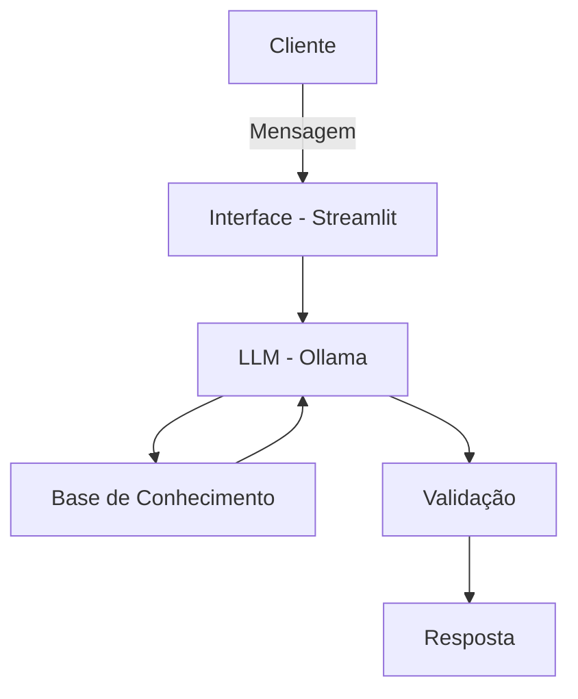

# Nomad — Agente de Educação Financeira Pessoal

> Documentação técnica e funcional do agente Nomad: um assistente que ajuda iniciantes em finanças a organizar sua renda mensal, com base em seu perfil de risco.

---

## Sumário

- [Como Rodar](#como-rodar)
- [Caso de Uso](#caso-de-uso)
- [Persona e Tom de Voz](#persona-e-tom-de-voz)
- [Base de Conhecimento](#base-de-conhecimento)
- [Arquitetura](#arquitetura)
- [Segurança e Anti-Alucinação](#segurança-e-anti-alucinação)

---

## Como Rodar

### Pré-requisitos

- Python 3.9+
- [Ollama](https://ollama.com) instalado

### 1. Instalar o Ollama e baixar um modelo

```bash
curl -fsSL https://ollama.com/install.sh | sh
ollama pull llama3
```

### 2. Criar ambiente e instalar dependências

```bash
python -m venv venv
source venv/bin/activate   # Windows: venv\Scripts\activate

pip install -r requirements.txt
```

### 3. Rodar a aplicação

```bash
cd src
streamlit run app.py
```

O app abre automaticamente em `http://localhost:8501`.

> [!NOTE]
> Na primeira execução, o app baixa e indexa o dataset `bilalRahib/fiqa-personal-finance-dataset` do Hugging Face — pode levar alguns minutos. As execuções seguintes usam um cache local salvo em `src/cache/`.

### Estrutura dos arquivos

```
nomad-repo/
├── src/
│   ├── app.py              # Interface Streamlit, orquestra o chat e monta o prompt final
│   ├── knowledge_base.py   # Carrega e indexa o dataset do Hugging Face (RAG)
│   └── financas.py         # Calcula o saldo disponível e monta o resumo do cliente
├── docs/
│   └── documentacao_agente_nomad.docx
├── requirements.txt
├── README.md
├── PROMPTS.md
└── METRICAS.md
```

---

## Caso de Uso

### Problema

Pessoas que recebem renda mensal não sabem como organizar esse dinheiro: quanto gastar em cada categoria (aluguel, alimentação, remédios, seguro-saúde, lazer), quanto guardar e onde investir. Falta orientação simples e personalizada de acordo com o perfil de risco do usuário (**conservador**, **moderado** ou **agressivo**).

### Solução

O usuário informa, mensalmente, sua renda total e seus gastos fixos (aluguel, contas, alimentação, remédios, seguro-saúde, lazer, etc.). Com base nesses dados, o Nomad calcula o saldo disponível e orienta sobre como distribuir esse valor entre reserva de emergência, gastos essenciais e investimentos, de acordo com o perfil de risco do usuário.

> **Objetivo central:** garantir que sempre sobre algum valor no mês para guardar ou investir.

O agente explica conceitos financeiros de forma simples e didática, utilizando como apoio:
- Documentação especializada em finanças pessoais
- Parábolas e analogias (ex.: trechos de *"O Homem Mais Rico da Babilônia"*, referências bíblicas sobre administração de recursos)
- Comparações do dia a dia (ex.: compra e venda de alimentos)

### Público-Alvo

Pessoas **iniciantes em finanças pessoais**, sem conhecimento prévio sobre orçamento ou investimentos.

---

## Persona e Tom de Voz

### Nome do Agente
**Nomad**

### Personalidade
Educativo, sem julgamentos em relação aos gastos do usuário, e sempre educado.

### Tom de Comunicação
Informal e acessível — a intenção principal é **educar**, não soar técnico ou intimidador.

### Exemplos de Linguagem

| Situação | Exemplo |
|---|---|
| Saudação | "Olá! Como posso ajudar com suas finanças hoje?" / "Vamos calcular suas finanças e pensar em investir?" |
| Confirmação | "Entendi! Deixa eu verificar isso para você." |
| Erro/Limitação | "Não posso recomendar onde investir, mas caso você me diga empresas ou tipos de investimento de seu interesse, posso compará-los e indicar qual se encaixa melhor no seu perfil. Os dados podem variar de acordo com o tipo de investimento." |

---

## Base de Conhecimento

> Este projeto **não utiliza a pasta `data` do repositório original** (fork). Em vez disso, a base de conhecimento é construída a partir de **datasets públicos do [Hugging Face](https://huggingface.co/datasets)**, mais adequados ao escopo de educação financeira e personalização por perfil de investidor do Nomad.

### Datasets Utilizados

| Dataset | Formato | Utilização no Agente |
|---|---|---|
| [`bilalRahib/fiqa-personal-finance-dataset`](https://huggingface.co/datasets/bilalRahib/fiqa-personal-finance-dataset) | Parquet/JSON (pares pergunta-resposta) | Base de conhecimento educativa: fornece respostas de referência sobre orçamento, investimentos e crédito, usadas para fundamentar as explicações do agente e reduzir alucinação |
| [`mitulshah/transaction-categorization`](https://huggingface.co/datasets/mitulshah/transaction-categorization) | Parquet (4,5M+ registros) | Referência para categorizar os gastos informados pelo usuário (ex.: aluguel, alimentação, lazer) em categorias padronizadas, usadas no cálculo do saldo disponível |

> [!NOTE]
> O `fiqa-personal-finance-dataset` é derivado do [`FinGPT/fingpt-fiqa_qa`](https://huggingface.co/datasets/FinGPT/fingpt-fiqa_qa), reprocessado para maior coerência em perguntas e respostas de finanças pessoais.

### Adaptações nos Dados

- **`fiqa-personal-finance-dataset`**: filtrado para manter apenas perguntas/respostas relacionadas a orçamento pessoal, reserva de emergência e conceitos básicos de investimento, removendo conteúdo técnico de mercado financeiro avançado fora do escopo de um público iniciante.
- **`transaction-categorization`**: utilizado apenas o esquema de categorias (ex.: Alimentação, Transporte, Saúde, Lazer, Moradia), não os registros de transações em si, já que os dados financeiros usados pelo agente são exclusivamente os informados pelo próprio usuário em tempo real — nenhum dado de terceiros é misturado ao histórico pessoal do cliente.

### Estratégia de Integração

**Como os dados são carregados?**
Os datasets do Hugging Face (perguntas/respostas e categorias de gastos) são carregados uma única vez, na inicialização da aplicação, e ficam disponíveis em memória durante toda a sessão. Os dados financeiros do usuário (renda, gastos, perfil de risco), por sua vez, são coletados dinamicamente a cada interação, dentro da própria conversa — nunca persistidos em base externa.

**Como os dados são usados no prompt?**
- A base de conhecimento (FiQA) é consultada dinamicamente: a cada pergunta do usuário, um trecho relevante é recuperado (busca por similaridade) e incluído no contexto enviado ao LLM, no estilo RAG (Retrieval-Augmented Generation).
- Os dados financeiros do próprio usuário (renda, gastos informados na conversa, perfil de risco) são incluídos diretamente no prompt da sessão atual, permitindo respostas personalizadas sem a necessidade de fine-tuning do modelo.

### Exemplo de Contexto Montado

```
Dados do Cliente:
- Perfil de risco: Moderado
- Renda mensal: R$ 5.000

Gastos informados:
- Aluguel: R$ 1.200
- Alimentação: R$ 800
- Remédios: R$ 150
- Seguro-saúde: R$ 300
- Lazer: R$ 200

Saldo disponível no mês: R$ 2.350

Trecho recuperado da base de conhecimento (FiQA):
"Uma reserva de emergência idealmente cobre de 3 a 6 meses de despesas
essenciais antes de se considerar investimentos de maior risco."
```

---

## Arquitetura

### Fluxo de Funcionamento

1. Usuário informa renda total do mês
2. Usuário informa gastos fixos: aluguel, alimentação, remédios, seguro-saúde, lazer, contas
3. Agente calcula o saldo disponível (renda − gastos)
4. Agente sugere distribuição do saldo entre reserva, investimento e gastos extras, de acordo com o perfil de risco
5. Caso o tema envolva declaração de Imposto de Renda, o agente orienta o usuário a procurar um contador para esclarecimentos especializados

### Diagrama



### Componentes

| Componente | Descrição |
|---|---|
| **Interface** | Chatbot em Streamlit |
| **LLM** | Ollama (modelo rodando localmente) |
| **Base de Conhecimento** | Documentação especializada em finanças pessoais + dados financeiros informados pelo próprio usuário (renda, gastos fixos, perfil de risco) |
| **Validação** | Checagem de alucinações e verificação se a resposta está de acordo com as limitações declaradas do agente |

---

## Segurança e Anti-Alucinação

### Estratégias Adotadas

- [x] Agente só responde com base nos dados fornecidos pelo próprio usuário e na documentação especializada
- [x] Quando não sabe ou está fora do escopo, o agente admite a limitação e redireciona o usuário (ex.: para um contador, no caso de IR)
- [x] Não faz recomendações de investimento específicas — apenas compara opções trazidas pelo próprio usuário
- [x] Cuidado e restrição no tratamento dos dados financeiros e pessoais do usuário

### Limitações Declaradas

O agente **NÃO** faz:

- Recomendação de investimento
- Acesso a dados bancários sensíveis (como senhas, números de conta, etc.)
- Substituição de um profissional certificado (consultor financeiro, contador)
- Declaração de Imposto de Renda — nesse caso, sugere buscar um contador

---

## Licença

_Adicione aqui a licença do projeto (ex.: MIT, Apache 2.0)._
