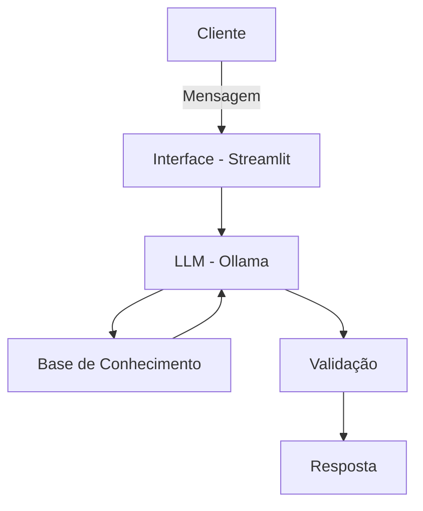

# Nomad — Agente de Educação Financeira Pessoal

> Documentação técnica e funcional do agente Nomad: um assistente que ajuda iniciantes em finanças a organizar sua renda mensal, com base em seu perfil de risco.

---

## Sumário

- [Caso de Uso](#caso-de-uso)
- [Persona e Tom de Voz](#persona-e-tom-de-voz)
- [Arquitetura](#arquitetura)
- [Segurança e Anti-Alucinação](#segurança-e-anti-alucinação)

---

## Caso de Uso

### Problema

Pessoas que recebem renda mensal não sabem como organizar esse dinheiro: quanto gastar em cada categoria (aluguel, alimentação, remédios, seguro-saúde, lazer), quanto guardar e onde investir. Falta orientação simples e personalizada de acordo com o perfil de risco do usuário (**conservador**, **moderado** ou **agressivo**).

### Solução

O usuário informa, mensalmente, sua renda total e seus gastos fixos (aluguel, contas, alimentação, remédios, seguro-saúde, lazer, etc.). Com base nesses dados, o Nomad calcula o saldo disponível e orienta sobre como distribuir esse valor entre reserva de emergência, gastos essenciais e investimentos, de acordo com o perfil de risco do usuário.

> **Objetivo central:** garantir que sempre sobre algum valor no mês para guardar ou investir.

O agente explica conceitos financeiros de forma simples e didática, utilizando como apoio:
- Documentação especializada em finanças pessoais
- Parábolas e analogias (ex.: trechos de *"O Homem Mais Rico da Babilônia"*, referências bíblicas sobre administração de recursos)
- Comparações do dia a dia (ex.: compra e venda de alimentos)

### Público-Alvo

Pessoas **iniciantes em finanças pessoais**, sem conhecimento prévio sobre orçamento ou investimentos.

---

## Persona e Tom de Voz

### Nome do Agente
**Nomad**

### Personalidade
Educativo, sem julgamentos em relação aos gastos do usuário, e sempre educado.

### Tom de Comunicação
Informal e acessível — a intenção principal é **educar**, não soar técnico ou intimidador.

### Exemplos de Linguagem

| Situação | Exemplo |
|---|---|
| Saudação | "Olá! Como posso ajudar com suas finanças hoje?" / "Vamos calcular suas finanças e pensar em investir?" |
| Confirmação | "Entendi! Deixa eu verificar isso para você." |
| Erro/Limitação | "Não posso recomendar onde investir, mas caso você me diga empresas ou tipos de investimento de seu interesse, posso compará-los e indicar qual se encaixa melhor no seu perfil. Os dados podem variar de acordo com o tipo de investimento." |

---

## Arquitetura

### Fluxo de Funcionamento

1. Usuário informa renda total do mês
2. Usuário informa gastos fixos: aluguel, alimentação, remédios, seguro-saúde, lazer, contas
3. Agente calcula o saldo disponível (renda − gastos)
4. Agente sugere distribuição do saldo entre reserva, investimento e gastos extras, de acordo com o perfil de risco
5. Caso o tema envolva declaração de Imposto de Renda, o agente orienta o usuário a procurar um contador para esclarecimentos especializados

### Diagrama

### Componentes

| Componente | Descrição |
|---|---|
| **Interface** | Chatbot em Streamlit |
| **LLM** | Ollama (modelo rodando localmente) |
| **Base de Conhecimento** | Documentação especializada em finanças pessoais + dados financeiros informados pelo próprio usuário (renda, gastos fixos, perfil de risco) |
| **Validação** | Checagem de alucinações e verificação se a resposta está de acordo com as limitações declaradas do agente |

---

## Segurança e Anti-Alucinação

### Estratégias Adotadas

- [x] Agente só responde com base nos dados fornecidos pelo próprio usuário e na documentação especializada
- [x] Quando não sabe ou está fora do escopo, o agente admite a limitação e redireciona o usuário (ex.: para um contador, no caso de IR)
- [x] Não faz recomendações de investimento específicas — apenas compara opções trazidas pelo próprio usuário
- [x] Cuidado e restrição no tratamento dos dados financeiros e pessoais do usuário

### Limitações Declaradas

O agente **NÃO** faz:

- Recomendação de investimento
- Acesso a dados bancários sensíveis (como senhas, números de conta, etc.)
- Substituição de um profissional certificado (consultor financeiro, contador)
- Declaração de Imposto de Renda — nesse caso, sugere buscar um contador

---

